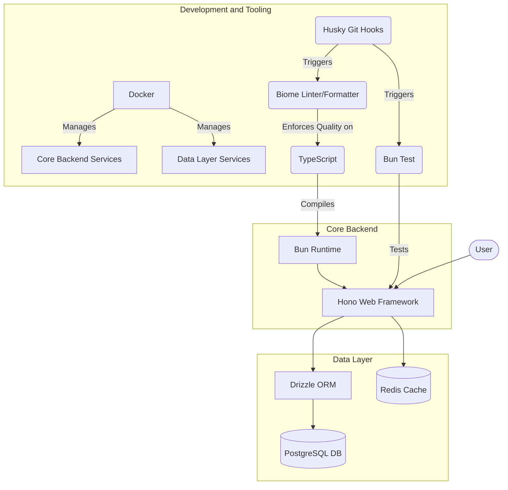

##### tl;dr

- **Tech stack**: Bun + Hono + Drizzle + PostgreSQL + Redis — ringan, cepat, DX minimal.
- **Fitur**: Auth (JWT + refresh token + lupa password), RBAC (Admin/Librarian/Member), manajemen buku & kategori, siklus peminjaman lengkap.
- **Arsitektur**: Routes (Zod OpenAPI) → Handlers → Repositories. Cache-aside Redis di layer Repository.
- **Tooling**: Biome (lint/format) + Husky (pre-commit) + Bun test.

---

Proyek ini dimulai sebagai studi kasus: membangun backend API untuk sistem E-Library dari awal. Aku pengen lebih dari sekadar endpoint yang berfungsi — aku mau arsitektur yang bersih, teruji, dan mengikuti praktik modern tanpa over-engineering.

Tech stack-nya: **Bun** sebagai runtime, **Hono** sebagai web framework, **Drizzle** sebagai ORM. Kombinasi ini ringan, cepat, dan DX-nya enak — terutama `bun test` yang built-in tanpa perlu Jest config berlembar-lembar.

## Fondasi: Otentikasi Dulu

Aku mulai dari layer paling dasar: otentikasi. Registrasi dan login standar, lalu diperkuat dengan **Refresh Token** via `HttpOnly` cookie dan alur **Lupa Password** pakai token sekali pakai. Tidak ada yang fancy — tapi semuanya harus solid sebelum lanjut ke fitur bisnis.

## Arsitektur: Pisah Tanggung Jawab

Kode dipecah jadi beberapa layer:

- **Routes** — definisi "kontrak" API pakai `@hono/zod-openapi`. Setiap endpoint punya skema request/response yang tervalidasi.
- **Handlers** — jembatan antara HTTP dan logika bisnis. Tidak boleh tahu soal database.
- **Repositories** — satu-satunya layer yang menyentuh database. Kalau mau ganti ORM, cukup ganti di sini.

## Fitur Inti: Buku, Kategori, Peminjaman

Manajemen buku dan kategori pakai RBAC — hanya `ADMIN` yang bisa operasi tulis. Siklus peminjaman lengkap: `MEMBER` mengajukan, `LIBRARIAN` menyetujui, lengkap dengan aturan bisnis seperti batas maksimal peminjaman.

## Optimasi: Redis & Rate Limiting

Redis dipasang sebagai cache untuk resource yang sering dibaca. Pola cache-aside: cek cache dulu, kalau tidak ada baru query database. Cache invalidation dilakukan di layer Repository — handler tidak perlu tahu.

Rate limiting per IP diterapkan sebagai middleware global biar API tidak disalahgunakan.

## Tooling: Biome + Husky

Biome untuk linting dan formatting — cepat, tanpa konfigurasi ribet. Husky sebagai penjaga commit: setiap commit otomatis dijalankan `bun test` dan `biome check`. Kalau ada yang gagal, commit ditolak.

Hasil akhirnya: sebuah backend API yang terstruktur, aman, dan siap dihubungkan ke frontend atau di-deploy. Kode lengkapnya di GitHub:

::github{repo="masmuss/hono-elibrary"}
