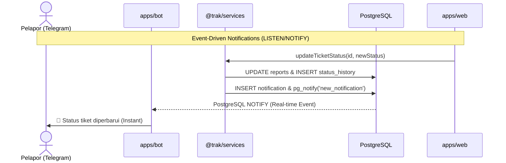

**tl;dr**

- **Notifikasi Real-time**: Mengganti sistem polling database 5 detik sekali pada bot Telegram dengan mekanisme _event-driven_ menggunakan PostgreSQL `LISTEN/NOTIFY`.
- **Database Session**: Migrasi penyimpanan sesi bot Telegram dari lokal file (`.bot-sessions/`) ke database PostgreSQL menggunakan adapter kustom.
- **UUID v7**: Mengganti UUID v4 dengan UUID v7 untuk primary key di seluruh tabel guna mengurangi fragmentasi indeks database (B-Tree).
- **Prioritas & SLA**: Implementasi sistem manajemen prioritas (`LOW` hingga `CRITICAL`) lengkap dengan kalkulasi tenggat waktu respon/resolusi (_SLA_) secara otomatis.
- **Identitas Visual**: Menambahkan logo robot-mark kustom untuk favicon, OG image, sidebar web, dan instruksi Telegram BotFather.

---

Di [postingan sebelumnya](/blog/notes/weekend-projects/trak), aku sempat cerita tentang pembuatan **Trak**—platform ticketing dan reporting sederhana berbasis monorepo untuk ngatasin bug verbal di kantor yang sering kelupaan. Di bagian akhir tulisan itu, aku berencana buat ganti sistem polling Telegram bot biar ga boros query ke database.

Nah, di akhir pekan kali ini, aku ga cuma berhasil beresin masalah polling itu, tapi juga nambahin banyak peningkatan arsitektur database, sistem prioritas tiket, kalkulasi SLA (_Service Level Agreement_), hingga identitas visual baru.

Jika ingin melihat bagaimana seluruh pembaruan ini diimplementasikan, silakan langsung intip repositori proyeknya:

::github{repo="masmuss/trak" label="Lihat di GitHub"}

## Selamat Tinggal Polling, Halo PostgreSQL LISTEN/NOTIFY!

Sebelumnya, bot Telegram berjalan dengan cara memanggil database setiap 5 detik sekali (`setInterval`) untuk mengecek apakah ada notifikasi tiket baru yang belum dikirim. Cara ini boros koneksi database dan menyisakan delay hingga 5 detik.

Untuk mengatasinya, aku memigrasi sistem ini menjadi _real-time event-driven_ menggunakan fitur bawaan PostgreSQL: **LISTEN/NOTIFY**.

### Bagaimana Cara Kerjanya?

1. Saat admin mengubah status tiket di dashboard SvelteKit, aplikasi memicu fungsi `createNotification()` di `@trak/services`.
2. Fungsi ini menyimpan notifikasi ke tabel database, lalu mengeksekusi perintah `NOTIFY new_notification, '<payload>'`.
3. Bot Telegram di sisi lain membuka satu koneksi persisten ke PostgreSQL dan menjalankan perintah `LISTEN new_notification` saat pertama kali dinyalakan.
4. Ketika event `NOTIFY` terpicu dari dashboard web, database langsung meneruskannya ke bot secara instan tanpa perlu polling. Bot langsung mengirim pesan update ke Telegram pelapor saat itu juga.

### Mekanisme Catch-Up saat Downtime

Masalah klasik dari sistem _event-driven_ murni adalah: _bagaimana jika bot Telegram mati (downtime) saat ada notifikasi masuk?_ Notifikasi tersebut akan hangus karena bot tidak sedang mendengarkan (_listening_).

Untuk mengatasi ini, aku menambahkan mekanisme **Catch-Up** pada bot saat _startup_:
Sebelum bot mulai mendengarkan event real-time, ia akan melakukan query sekali ke database untuk mencari semua notifikasi yang berstatus `is_read = false` (belum terkirim). Notifikasi-notifikasi "ketinggalan" ini akan dikirimkan terlebih dahulu ke user, baru setelah itu bot mengaktifkan mode _LISTEN_ untuk event baru.

## Memindahkan Sesi Bot ke Database (PostgreSQL Session Adapter)

Sebelumnya, bot Telegram menyimpan sesi pengguna (seperti state langkah pelaporan yang sedang berjalan) ke dalam berkas lokal di folder `.bot-sessions/`.

Meskipun sederhana, cara ini mempersulit deployment di server (misalnya saat memakai Docker container) karena aku harus setup _persistent volume_ agar sesi user tidak hilang setiap kali container di-restart.

Solusinya, aku membuat **PostgreSQL Session Adapter** kustom menggunakan Drizzle ORM:

- Membuat tabel baru `bot_sessions` dengan kolom `key` (ID chat Telegram) dan `data` (format `jsonb` berisi state sesi).
- Mengganti modul penyimpanan bawaan grammY dengan adapter database kustom tersebut.
- Sekarang, status percakapan user tersimpan aman di database PostgreSQL pusat. Aku bebas me-restart atau me-redeploy aplikasi bot kapan saja tanpa takut merusak alur percakapan yang sedang berjalan.

## Efisiensi B-Tree Database dengan UUID v7

Pada versi awal, Trak menggunakan UUID v4 acak (via `gen_random_uuid()`) sebagai primary key untuk 7 tabel utama. UUID v4 sangat aman dari kolisi, namun karena sifatnya yang acak, ia memiliki performa buruk pada PostgreSQL ketika jumlah data membengkak. Struktur indeks B-Tree database akan mengalami fragmentasi (_page fragmentation_) karena baris data baru harus disisipkan di posisi acak di tengah-tengah indeks tree.

Untuk mengatasinya, aku memigrasi primary key di semua tabel database menggunakan **UUID v7**:

- **Time-Ordered**: UUID v7 menggabungkan timestamp milidetik di bagian awal id, diikuti oleh karakter acak. Artinya, id baru akan selalu memiliki nilai yang lebih besar dari id sebelumnya secara berurutan.
- **Indeks Lebih Cepat**: Karena nilainya berurutan sesuai waktu pembuatan data, PostgreSQL cukup menyisipkan id baru di bagian akhir indeks B-Tree (_append-only_), mengurangi fragmentasi halaman memori secara signifikan.
- **UUID Generation di Level Aplikasi**: Pembuatan UUID v7 dilakukan langsung pada level aplikasi (Node/Bun runtime) sebelum query dikirim ke database untuk kemudahan koordinasi data.

## Sistem Prioritas & SLA (Service Level Agreement) Tracking

Agar Trak tidak sekadar menjadi aplikasi penampung keluhan biasa, aku menambahkan sistem prioritas tiket dan pemantauan SLA untuk mengukur kecepatan respon developer terhadap isu yang dilaporkan.

### Fitur Prioritas yang Diterapkan:

1. **Priority Levels**: Tiket kini mendukung level prioritas: `LOW`, `MEDIUM`, `HIGH`, dan `CRITICAL`.
2. **Kalkulasi Deadline SLA**: Setiap tiket yang dibuat otomatis memiliki tenggat respon (`slaResponseDue`) dan tenggat resolusi (`slaResolveDue`) berdasarkan waktu pembuatan dan tingkat prioritasnya (misalnya, isu `CRITICAL` harus direspon dalam 1 jam dan selesai dalam 4 jam).
3. **Reschedule SLA**: Jika admin mengubah tingkat prioritas tiket dari dashboard web, sistem secara otomatis menghitung ulang deadline SLA yang baru sejak tiket pertama kali dibuat.
4. **Deteksi SLA Breach**: Ditambahkan flag reaktif `isSlaBreached` yang otomatis mendeteksi jika developer terlambat merespon atau menyelesaikan tiket melewati batas waktunya.
5. **Notifikasi Prioritas ke Telegram**: Setiap ada perubahan prioritas tiket oleh admin, bot Telegram akan langsung mengirimkan pesan pemberitahuan ke pelapor beserta detail deadline barunya.

Di sisi UI dashboard web SvelteKit, aku menambahkan komponen `PriorityBadge` dengan ikon berwarna khusus untuk setiap level prioritas, `TicketPriorityForm` untuk mengubah prioritas tiket secara instan, serta fitur filter server-side berdasarkan Prioritas dan SLA di tabel utama tiket.

## Refactor Bot Telegram & Peningkatan UX

Selain fitur-fitur di atas, aku juga melakukan perbaikan secara ekstensif pada sisi bot Telegram untuk membuat _codebase_ lebih rapi dan pengalaman pengguna (UX) lebih mulus:

- **Refactoring Massal `bot.ts`**: Memisahkan logika yang tadinya menumpuk di satu file (202 baris) menjadi modul-modul kecil terpisah seperti `utilities`, `keyboards`, `helpers`, dan `handlers`. Sekarang file utama `bot.ts` hanya berisi 70 baris untuk _bootstraping middleware_ dan registrasi _handler_.
- **Interactive Welcome Keyboard**: Mengganti daftar perintah teks biasa (seperti `/lapor`, `/bantuan`) pada saat registrasi sukses atau pemanggilan `/start` dengan _inline keyboard_ interaktif yang jauh lebih modern dan mudah digunakan.
- **Konsistensi Navigasi & Alur Laporan**: Menambahkan tombol `❌ Batal` pada pemilihan kategori, menghilangkan opsi _skip_ yang redundan, dan memastikan pengguna selalu mendapat tombol navigasi yang konsisten di setiap langkah.
- **Cek Status Instan**: Menambahkan pintasan `🔍 Cek status` setelah laporan berhasil dikirim dan mengaktifkan perintah `/status` agar pelapor bisa memantau progres tiketnya tanpa harus membuka web.

Di sisi web dashboard, aku juga memperbaiki _bug_ sinkronisasi URL parameter saat _user_ membersihkan (_clear_) filter pada tabel data tiket.

---

Pembaruan akhir pekan kali ini benar-benar mengubah arsitektur Trak dari sekadar proyek _weekend_ menjadi platform _ticketing_ yang lebih tangguh, efisien, dan memiliki UX yang jauh lebih baik. Transisi ke PostgreSQL _LISTEN/NOTIFY_, penyimpanan sesi di database, optimasi UUID v7, hingga _refactoring_ bot Telegram membuat fondasi aplikasinya semakin solid.

Rencana berikutnya? Karena sekarang infrastrukturnya sudah mendukung _event-driven_ secara _real-time_, aku tertarik untuk mengeksplorasi pembuatan fitur _real-time chat_ agar komunikasi antara pelapor (via Telegram) dan admin (via _dashboard_) bisa terjadi secara langsung. Selain itu, mungkin aku juga akan mencoba membuat laporan statistik performa resolusi tiket bulanan dalam bentuk grafik interaktif.

Sampai jumpa di catatan proyek akhir pekan berikutnya! _Happy coding!_
