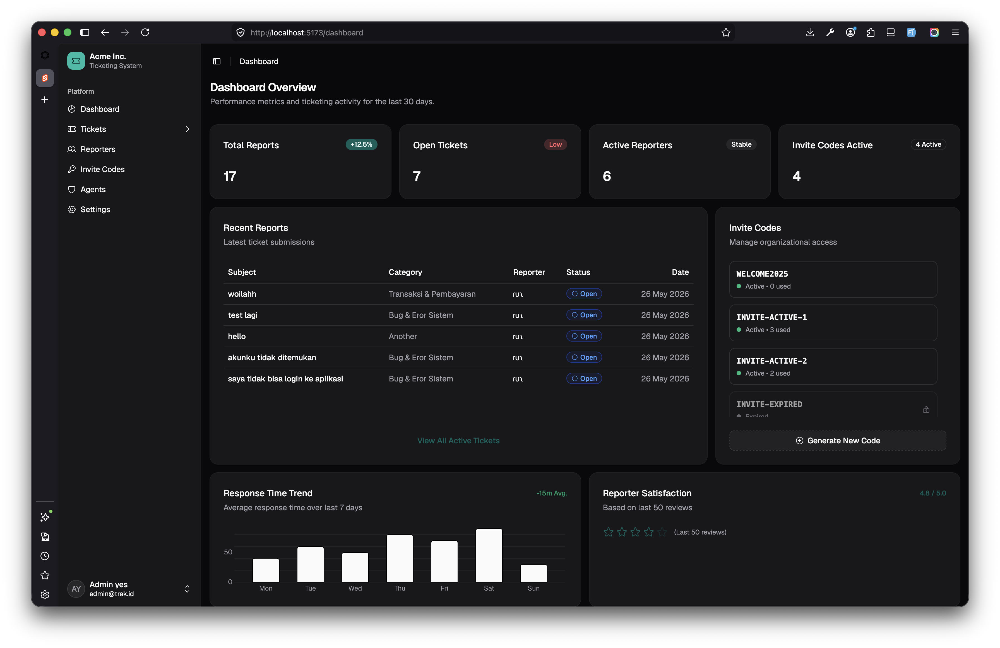
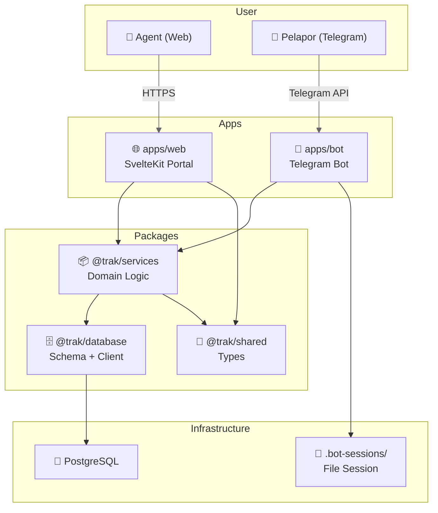
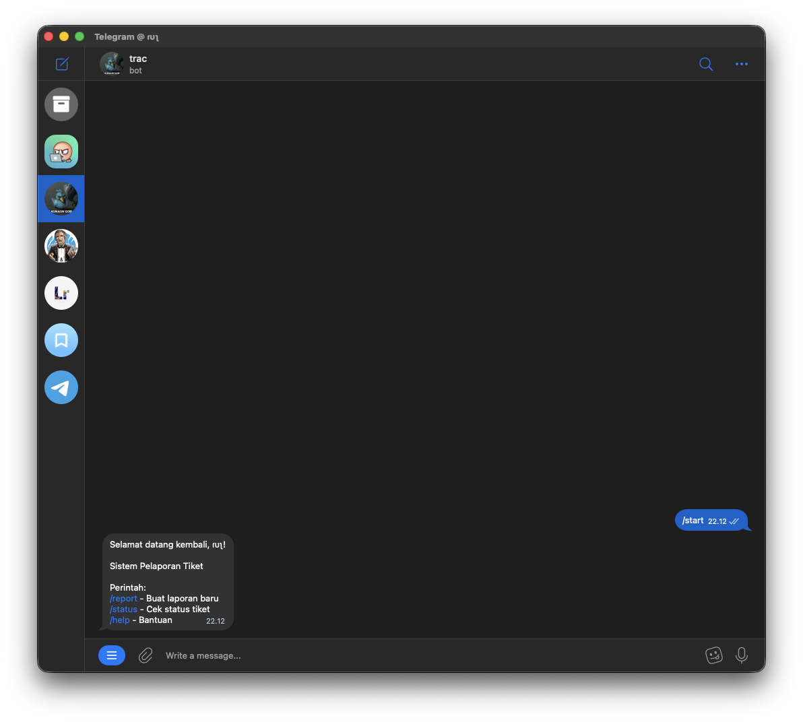
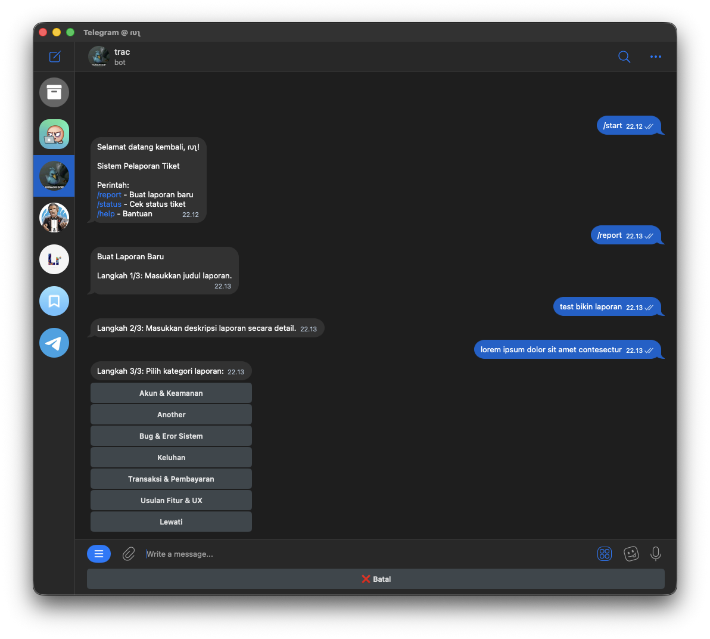
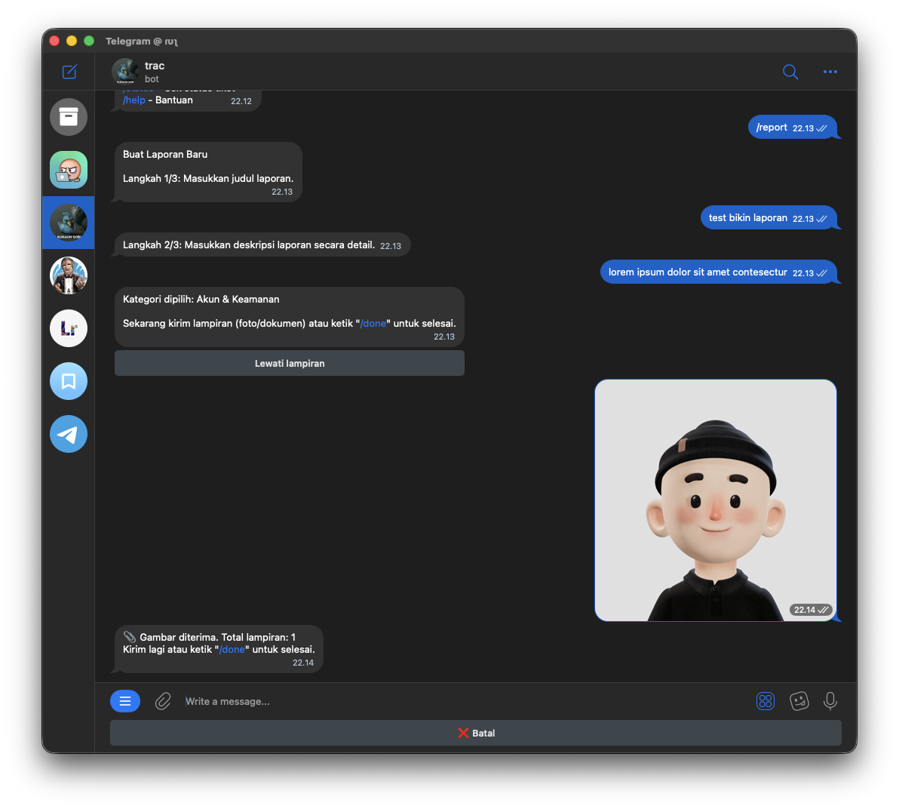
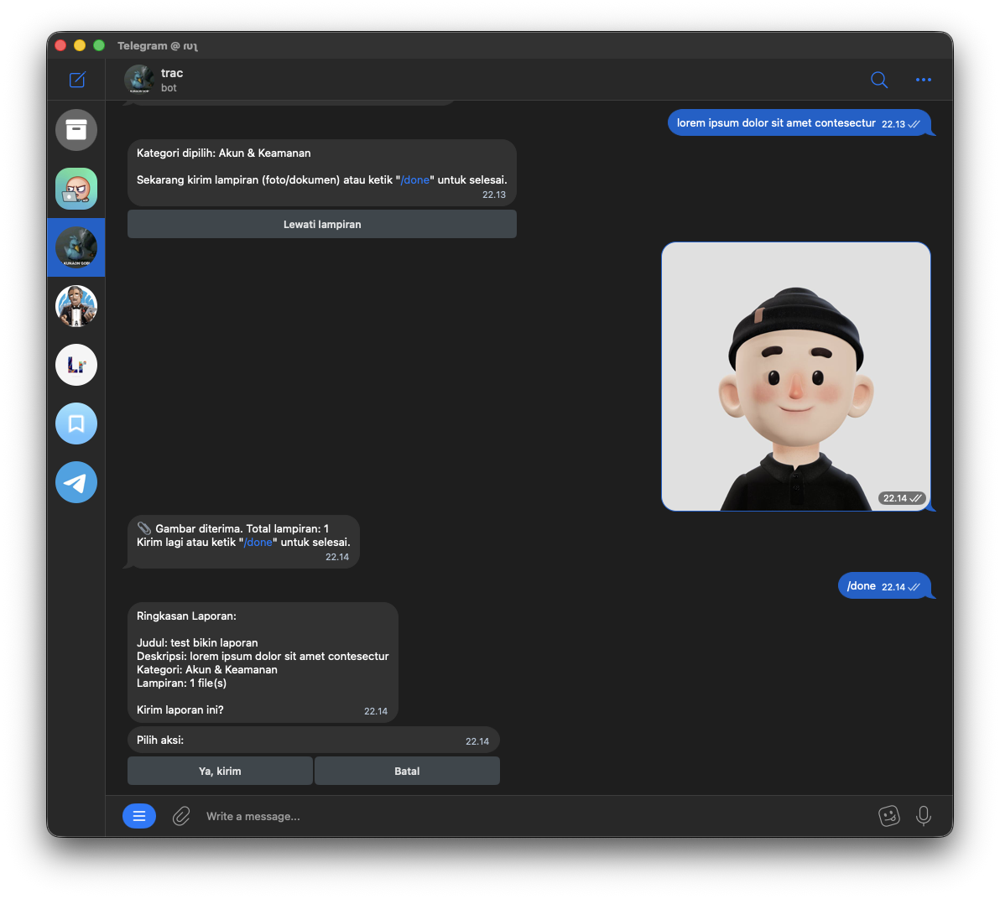
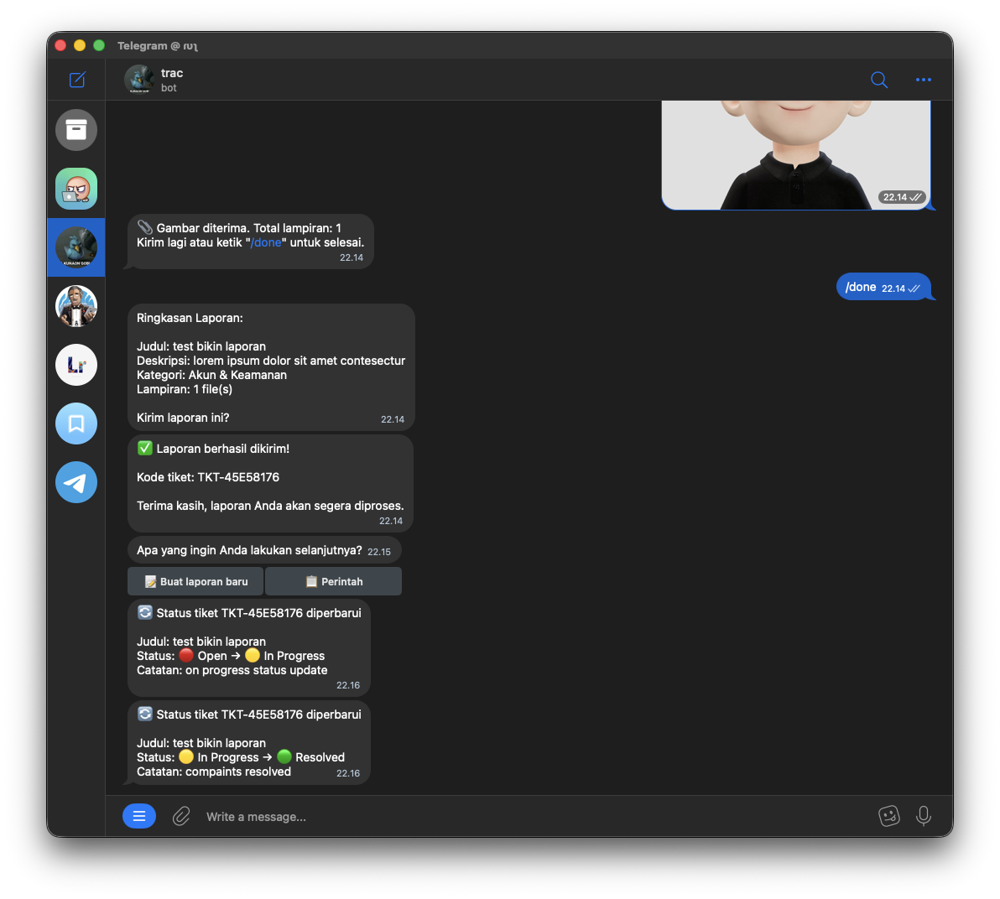
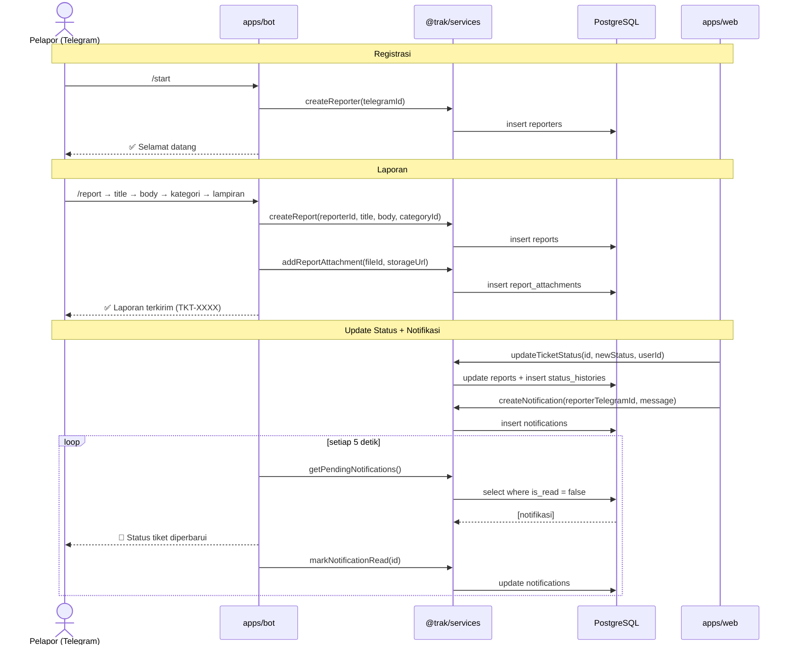

##### tl;dr

- **Latar belakang**: Kerjaan sehari-hari sebagai software developer di konsultan pendidikan sering nerima laporan bug lewat chat atau obrolan lisan. Hasilnya? Sering lupa nyatet dan isu yang sama ditanyain berulang kali.
- **Trak**: "Command center" ticketing sederhana biar pelapor gampang kirim isu (lewat Telegram Bot) dan aku gampang ngelolanya (lewat Web Dashboard).
- **Misi Belajar**: Nyoba Svelte 5 (Runes) buat pertama kalinya biar ga kejebak di _tutorial hell_ wkwkwk.
- **Tech Stack**: Monorepo pake Turborepo + pnpm workspaces, SvelteKit, grammY (Telegram bot), Drizzle ORM, dan PostgreSQL.
- **Next Update**: Ini baru versi pertama (MVP). Nanti kalau ada update fitur baru, bakal aku tulis di post terpisah!

---

Sebagai developer yang megang pengembangan dan maintenance produk digital—baik internal maupun eksternal—di konsultan pendidikan tempatku kerja, tantangan terbesarnya kadang bukan pas nulis baris kodenya. Tapi pas ngelola keluhan atau _complaint_ dari tim internal maupun user.

Selama ini, kalau ada isu atau bug dari tim produk, operasional, atau klien, jalurnya kasual banget: dikirim lewat chat personal, grup WhatsApp/Telegram, obrolan santai pas ketemu langsung di kantor, atau bahkan pas lagi _online meeting_.

Masalah klasiknya muncul: **Aku sering lupa nyatet.**

Selang beberapa hari, bug yang sama ditanyain lagi, disampaikan berulang-ulang, dan aku cuma bisa mikir, _"Aduh, kemarin kelupaan ditaruh di mana ya catatannya?"_ Gara-gara keresahan pribadi inilah aku mutusin buat ngisi waktu akhir pekan kemarin dengan bikin **Trak**—sebuah platform ticketing & reporting terpusat.



Mumpung lagi _weekend project_, ini juga sekalian jadi kesempatan emas buatku nyoba teknologi baru yang udah lama masuk _reading list_: **Svelte**.

Kalau kamu kepo sama struktur kodenya, silakan langsung intip repositorinya di sini:

::github{repo="masmuss/trak" label="Lihat di GitHub"}

## Keluar dari "Tutorial Hell" & Kenapa Nyoba Svelte?

Jujur aja, ini pertama kalinya aku nyentuh **Svelte**. Sebelumnya aku terbiasa pake React, Vue, dan terakhir nyobain Astro. Svelte sebenernya udah lama bikin aku penasaran, tapi kemarin-kemarin cuma mentok di baca dokumentasi atau nonton video tutorial tanpa bikin apa-apa—alias kejebak di _tutorial hell_ wkwkwkwk.

Lewat Trak, aku maksa diriku buat langsung _hands-on_. Dan setelah nyobain sendiri, ternyata emang seseru itu! Ini beberapa poin yang bikin aku suka:

1. **Sintaksnya Simpel Banget**: Ga banyak _boilerplate_ yang bikin pusing. Nulis Svelte berasa kayak nulis HTML, CSS, dan JS biasa tanpa abstraksi yang ribet.
2. **Svelte 5 Runes**: Karena aku mulainya pas Svelte 5 rilis, aku langsung cobain fitur _Runes_ kayak `$state`, `$derived`, dan `$effect`. Buat ngelola state reaktif di dashboard admin, rasanya jauh lebih eksplisit dan gampang didebug dibanding cara lama.
3. **Ga Pake Virtual DOM**: Svelte ngecompile kode langsung jadi manipulasi DOM asli pas _build time_. Hasilnya? Aplikasi jadi super kenceng dan ukuran bundlenya kecil banget, cocok buat ditaruh di server dengan spek minimalis.

## Arsitektur Monorepo: Bagi-Bagi Tugas Modul

Trak punya dua runtime terpisah: web dashboard buat admin (aku sendiri) dan Telegram bot buat para pelapor. Biar tipe data dan skema database-nya ga perlu di-copas manual bolak-balik, aku bikin arsitektur **Monorepo** pake **pnpm workspaces** dan **Turborepo**.

Struktur foldernya dibagi kayak gini:

| Modul/Folder        | Tipe     | Peran / Deskripsi                                                                                   |
| ------------------- | -------- | --------------------------------------------------------------------------------------------------- |
| `apps/web`          | Aplikasi | Portal dashboard admin berbasis SvelteKit (Runes), Tailwind CSS v4, shadcn-svelte, dan Better Auth. |
| `apps/bot`          | Aplikasi | Telegram Bot pake grammY biar staf/user bisa langsung lapor bug lewat Telegram mereka.              |
| `packages/services` | Package  | Isinya logic bisnis utama (domain logic) yang dipake barengan sama aplikasi web dan bot.            |
| `packages/database` | Package  | Pengaturan database pake Drizzle ORM, migrasi PostgreSQL, dan client-nya.                           |
| `packages/shared`   | Package  | Tempat nyimpen tipe data global TypeScript dan konstanta bersama.                                   |

Biar lebih kebayang gimana modul-modul ini saling nyambung di dalam monorepo, ini bagan sederhananya:



## Alur Kerja: Dari Telegram Chat Langsung ke Dashboard

Alur yang paling juara di Trak adalah bagian Telegram bot-nya. User di kantorku ga perlu repot-repot buka web dashboard cuma buat lapor bug. Cukup lewat Telegram yang emang tiap hari mereka buka buat kerjaan.

Prosesnya dibagi jadi dua tahap utama:

### 1. Registrasi Pelapor (Invite Code khusus Tester)

Staf kantor bisa langsung pakai bot ini cukup dengan mengetik perintah `/start` di Telegram buat mendaftarkan akun mereka sebagai `Reporter`. Tapi khusus buat para **tester**, ada opsional `invite_code` (kode undangan) pas registrasi buat nyoba fitur-fitur eksperimental sebelum dirilis ke staf umum.



### 2. Kirim Laporan & Terima Notifikasi Update

User tinggal ketik `/report` lalu bot bakal nanya judul, isi keluhan, kategori, sampai minta upload screenshot bug-nya. Semua data ini kesimpen di tabel `reports` dan `report_attachments`, lalu pelapor dapet nomor tiket unik (misal: `TKT-XXXX`).

Pas status tiketnya aku ubah di Web Dashboard SvelteKit (misal dari _Open_ ke _In Progress_ atau _Resolved_), sistem bakal otomatis bikin notifikasi baru. Bot Telegram bakal nge-polling database tiap 5 detik sekali buat nyari notifikasi baru yang belum dibaca, ngirim pesannya ke chat Telegram pelapor, terus nandain notifikasi itu sebagai sudah dibaca (`is_read = true`).

Berikut adalah beberapa cuplikan interaksi Telegram bot-nya saat pelapor membuat tiket hingga mendapatkan notifikasi otomatis:

- **Pilih Kategori Isu**: Ketika melapor, bot bakal nampilin pilihan kategori yang interaktif.
  
- **Kirim Detail & Lampiran**: User bisa upload gambar/screenshot sebagai bukti pendukung bug.
  
- **Konfirmasi Pembuatan Tiket**: Begitu selesai, bot ngasih konfirmasi sukses beserta ID tiket unik.
  
- **Notifikasi Update Status**: Bot otomatis ngirim pesan kalau status tiketnya diubah sama admin di web.
  



## Setup Lokal dengan Cepat

Kalau kamu tertarik mau coba jalankan monorepo ini di lokal, caranya gampang banget:

```bash
# Install semua dependencies secara paralel
pnpm install

# Setup env variables
cp .env.example .env
cp apps/bot/.env.example apps/bot/.env

# Push skema Drizzle ke PostgreSQL lokal
pnpm db:push

# (Opsional) Jalankan database seed
pnpm db:seed

# Nyalakan server development (web dashboard + bot Telegram sekaligus)
pnpm dev
```

## Penutup & Rencana ke Depan

Bikin Trak di akhir pekan kemarin lumayan ngebantu aku buat beresin masalah klasik \"lupa nyatet bug lisan\" di kantor, sekaligus ngebuktiin kalau belajar framework baru lewat proyek nyata itu jauh lebih efektif ketimbang cuma mantengin video tutorial berjam-jam.

Oh iya, **ini masih versi pertama (MVP)**. Jadi fiturnya emang masih dibikin sesimpel mungkin biar cepet kelar dan langsung bisa dipake kerja. Nanti kalau ada update fitur baru lagi (kayak ngeganti sistem polling bot jadi pake Redis Queue biar ga boros query ke database), aku bakal tulis di postingan blog berikutnya!

Apakah di kantormu juga sering ada drama \"lapor bug lewat lisan terus kelupaan\"?. _Happy coding!_
