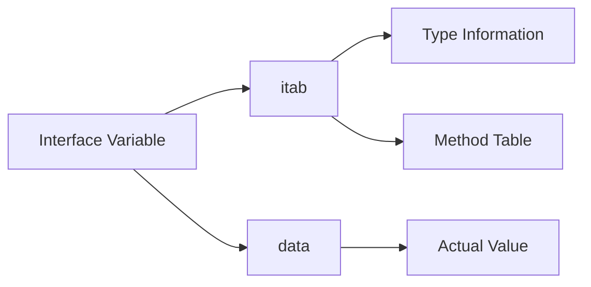

Kita telah sampai di akhir perjalanan seri **Deep Dive**. Untuk menutupnya dengan berkesan, kita akan membahas salah satu fitur paling ikonik di Go: **Interface**.

Secara penggunaan, interface sangat simpel. Namun, pernahkah kamu bertanya-tanya: _Bagaimana Go tahu kalau suatu tipe data memenuhi suatu interface tanpa kita harus menulis kata kunci 'implements'?_

## Struktur Memori Interface

Di balik layar, sebuah interface bukan cuma sebuah nilai kosong. Go merepresentasikannya sebagai data dua kata (two-word data structure), yang sering disebut **Fat Pointer**.

1.  **Word 1: itab (Interface Table)**: Pointer ke informasi tentang tipe data asli dan daftar method yang tersedia.
2.  **Word 2: data**: Pointer ke data atau variabel aslinya.



## interface{} vs any

Sejak Go 1.18, `any` hanyalah alias untuk `interface{}`. Saat kita menggunakan `any`, bagian **itab** pada struktur di atas akan menunjuk langsung ke tipe datanya (karena tidak ada method yang perlu divalidasi). Inilah kenapa kita bisa memasukkan tipe data apa pun ke dalam `any`.

## Dynamic Dispatch: Bagaimana Method Dipanggil?

Saat kamu memanggil method dari sebuah interface, Go melakukan proses yang disebut **Dynamic Dispatch**.
Go tidak langsung tahu fungsi mana yang harus dijalankan saat kompilasi. Ia melihat ke dalam **Method Table** di dalam **itab** saat runtime untuk menemukan fungsi yang benar.

Meskipun ini sangat fleksibel, ada biaya performa kecil dibandingkan memanggil fungsi secara langsung. Namun, bagi sebagian besar aplikasi, perbedaan ini tidak terasa dan sebanding dengan fleksibilitas yang didapat.

## Tip: Nil Interface vs Nil Value

Ini adalah jebakan Batman yang sering dialami Gopher pemula. Sebuah interface baru dianggap `nil` jika **keduanya** (itab dan data) adalah `nil`.

```go
var r io.Reader // itab=nil, data=nil. r == nil (TRUE)

var p *os.File = nil // p adalah pointer nil
r = p // itab=os.File, data=nil. r == nil (FALSE!)
```

Inilah kenapa terkadang kamu mengecek `if err != nil` dan hasilnya true, padahal isinya terlihat kosong. Selalu berhati-hati saat mengembalikan pointer nil ke dalam interface.

## Penutup Seri Deep Dive

Kamu telah menuntaskan perjalanan mendalam di dunia Go. Dari Generics, Context, hingga jeroan Interface.

Dengan memahami apa yang terjadi di bawah kap mesin, kamu bukan lagi sekadar menulis kode yang "jalan", tapi menulis kode yang kamu mengerti sepenuhnya perilakunya.

Terima kasih telah mengikuti seri **Becoming Gopher**.
